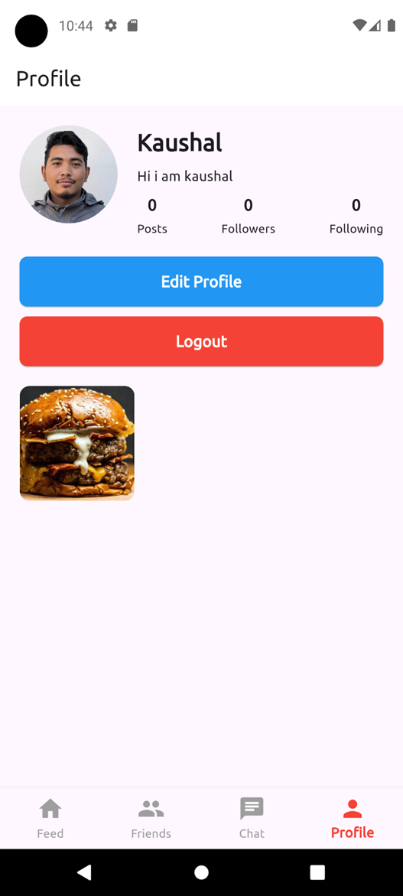
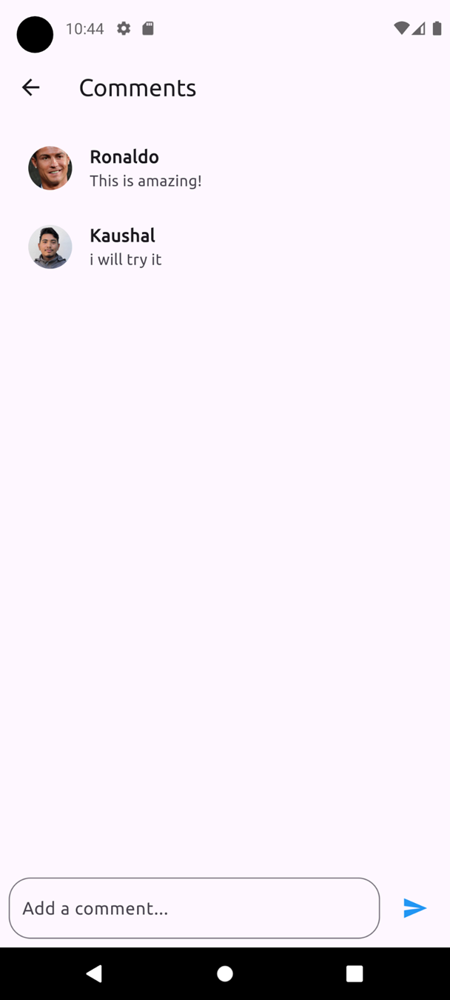
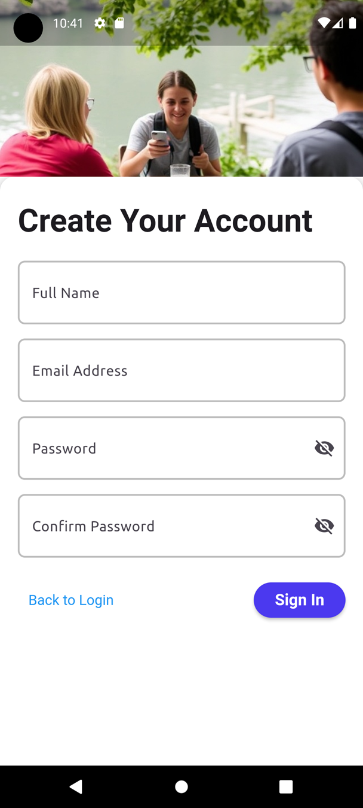
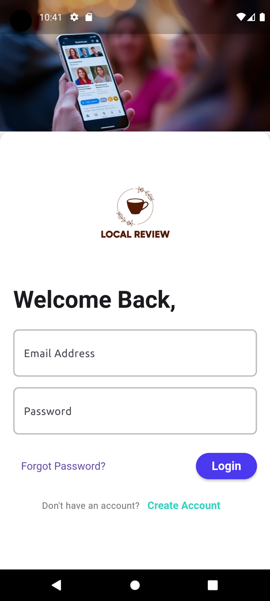
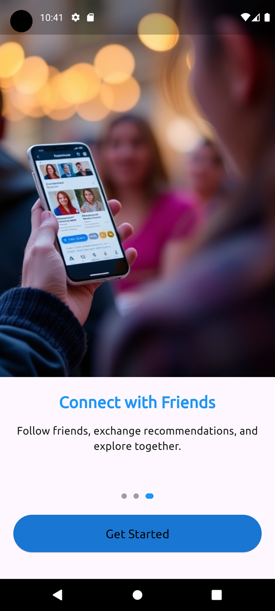
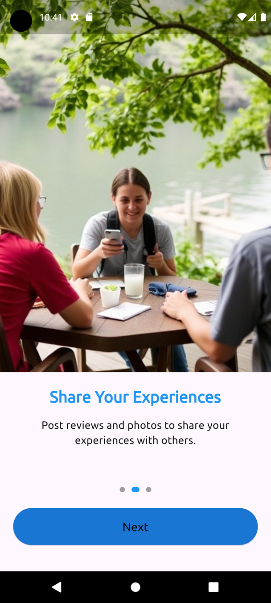
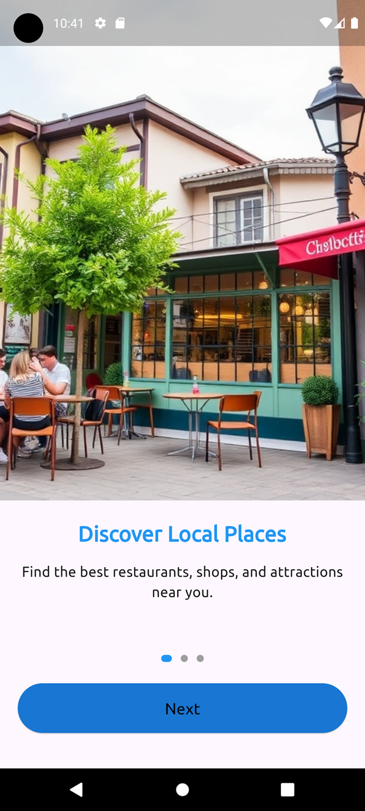
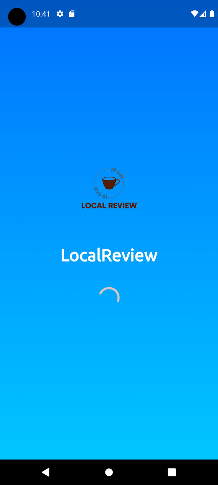

LocalReview

LocalReview is a social media platform focused on user-generated reviews, bridging the gap between traditional review sites and modern social engagement. Users can post reviews, like, comment, follow/unfollow others, and chat in real time. Built with Flutter (Dart) for the frontend and Node.js for the backend, it ensures a seamless experience. The app utilizes BLoC for state management, ensuring efficient data handling and responsiveness. LocalReview redefines how users interact with reviews and recommendations.

